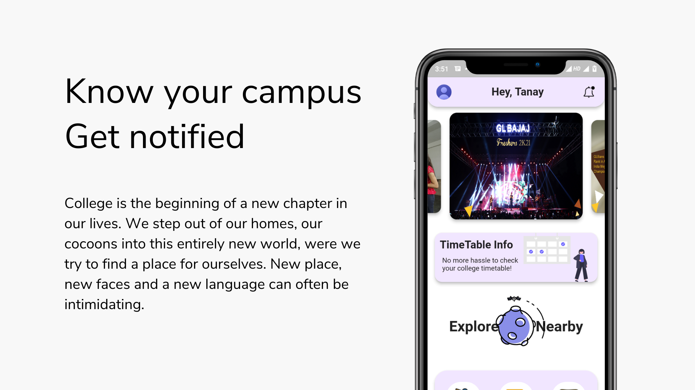
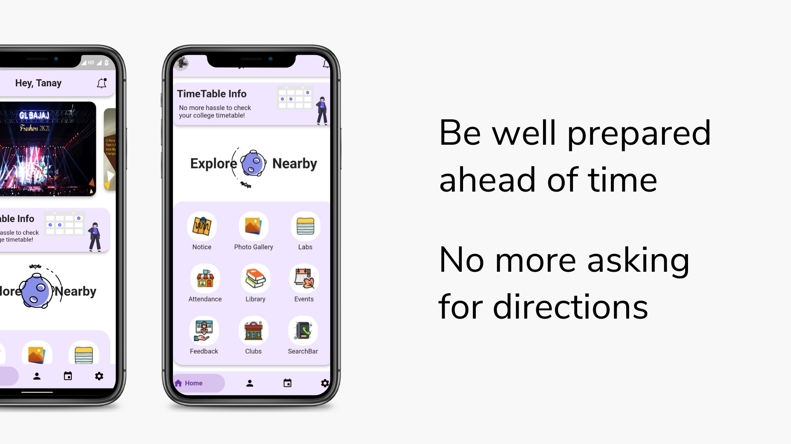
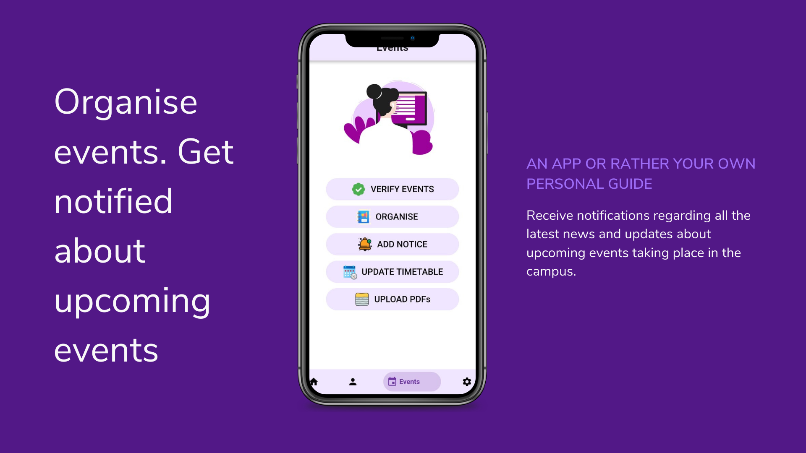
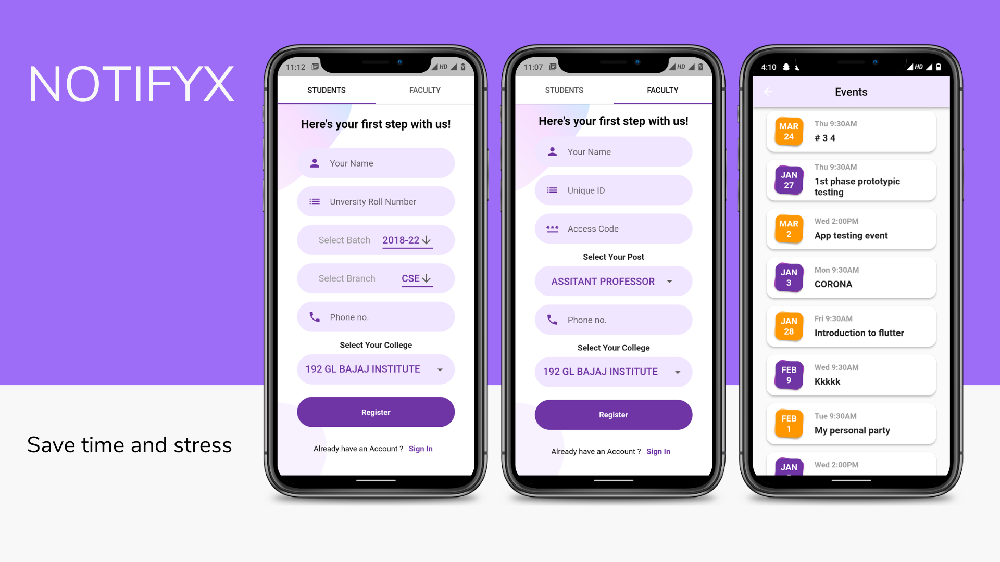
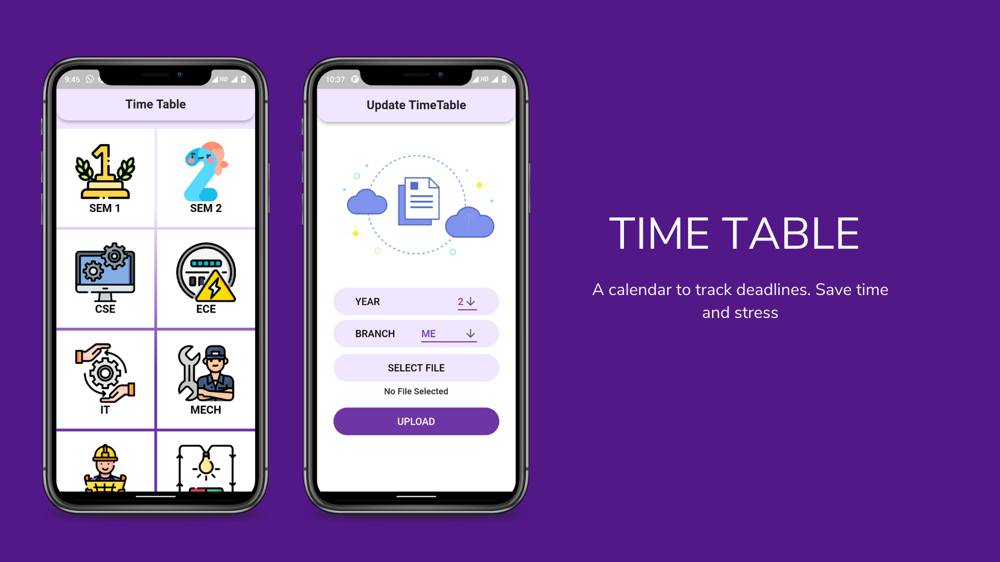
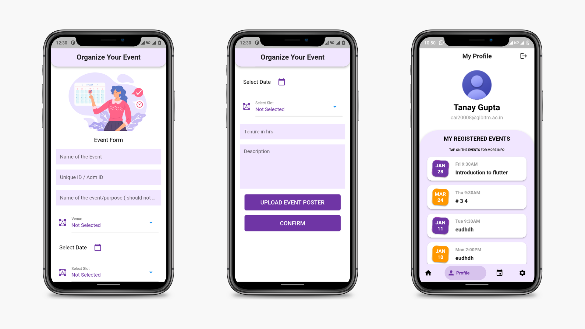
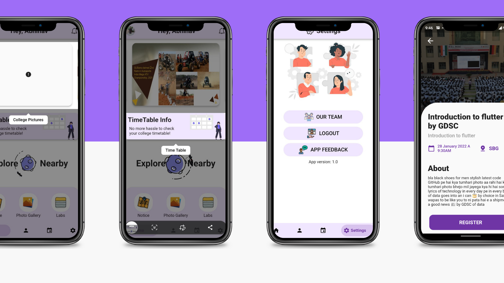

# NotifyX-The College App

Notifyx is a college app that helps students stay organized and informed. With Notifyx, you can:

- View your timetable in a clear and easy-to-read format.
- Get directions to your classes with the built-in map.
- Receive notifications about upcoming events and deadlines.
- Stay connected with your classmates through the forum and chat   features.
- Access your grades and other academic information.

Notifyx is built using Flutter and Firebase, so it's fast, reliable, and secure. And since it's cloud-based, you can access it from anywhere.

Whether you're a first-year student or a seasoned veteran, Notifyx is the perfect app to help you stay on top of your college life.


## Features

- Timetable: View your timetable in a clear and easy-to-read format.
- Map: Get directions to your classes, labs & halls.
- Notifications: Receive notifications about upcoming events and deadlines.
- Forum: Stay connected with your classmates through the forum.
- Grades: Access your grades and other academic information.


## Contributors

- [@Tanay-Gupta](https://github.com/Tanay-Gupta)
- [@Abhi149209](https://github.com/Abhi149209)
- [@carbseater](https://github.com/carbseater)
- [@GeekyMonk07](https://github.com/GeekyMonk07)


## Screenshots












## Run Locally

Clone the project

```bash
  git clone https://github.com/Tanay-Gupta/NotifyxCollegeApp


```

Go to the project directory

```bash
  cd NotifyxCollegeApp
```

Install dependencies

```bash
  flutter pub get

```

Run the app:

```bash
  flutter run

```


## Contributing

Contributions are welcome! If you have any feature requests or bug reports, please feel free to open an issue or a pull request.

See `contributing.md` for ways to get started.

Please adhere to this project's `code of conduct`.


## License

This project is licensed under the [MIT License](https://choosealicense.com/licenses/mit/).

